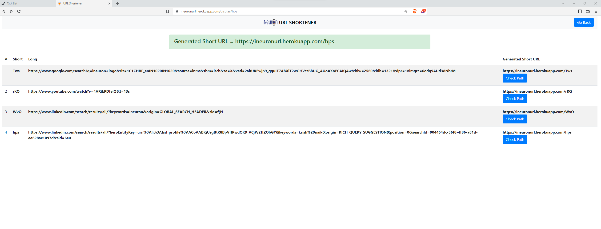
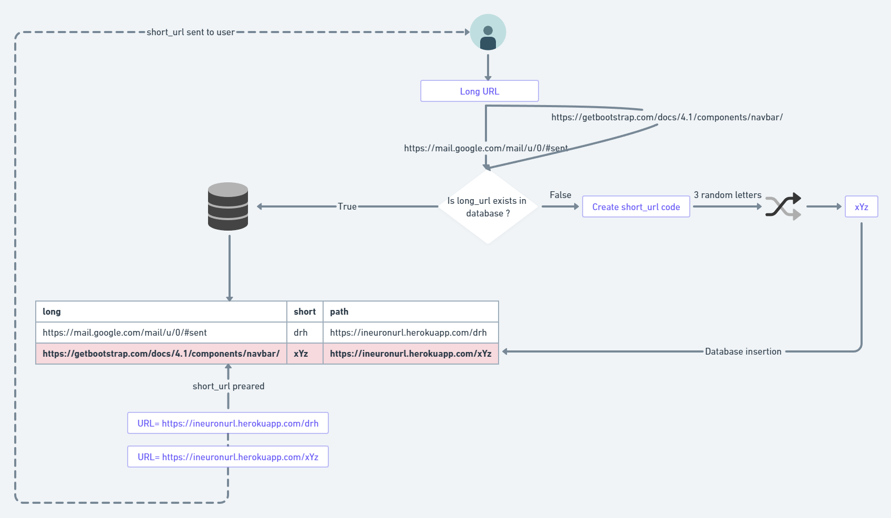

<h1 align="center">Python URL Shortener </h1>

Application url : [URL_Shortner](https://ineuronurl.herokuapp.com/)

<h5> URLs can be extremely long and not user-friendly. A URL shortener reduces the number of characters in a URL, making it easier to read, remember, and share.</h5>

##   <b>Approach</b>


- Use Flask
- Use SQLAlchemy database and interact with it with CRUD operations

##  <b> API</b>





 ## 💻 How to setup:


Creating conda environment
```
conda create -p venv python==3.8 -y
```

activate conda environment
```
conda activate ./venv
```

Install requirements
```
pip install -r requirements.txt
```
Run the live server using uvicorn
```
python app.py
```
To launch  ui
```
http://127.0.0.1:5000/
```

 ## <b> Technologies Used</b>


 <p align="center">

 1. Flask
 2. SQLAlchemy database

 ## 🏭 Industrial Use-cases 


 - Shortened URLs are more streamlined in appearance
 - Shortened URLs are Easier to replicate
 
 ## 👋 Conclusion

  With yourour URL shortener wecan now convert long URLs into tiny, shareable links. 
